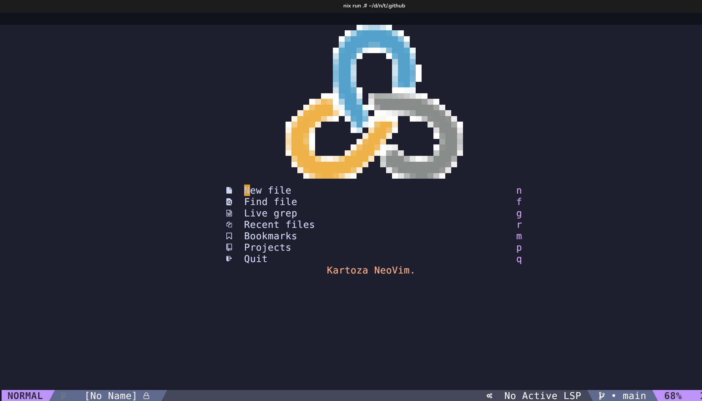
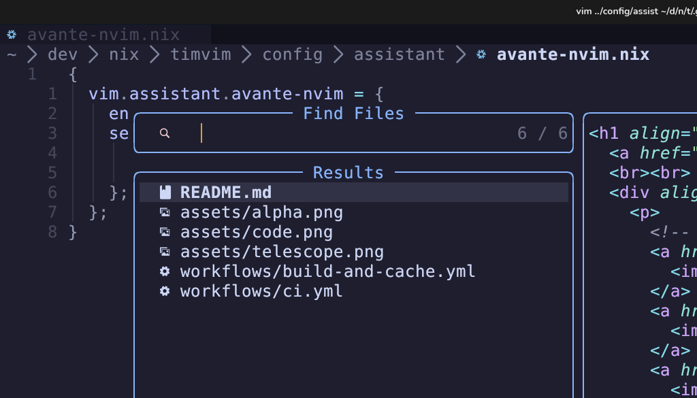

<h1 align="center">
  <a href="#"></a>
  <br><br>
  <div align="center">
    <p>
      <!-- ✅ Your existing badges -->
      <a href="https://github.com/timlinux/timvim/issues">
        
      </a>
      <a href="https://github.com/timlinux/timvim/pulse">
        
      </a>
      <a href="https://github.com/timlinux/timvim/stargazers">
        
      </a>
      <a href="https://github.com/timlinux/timvim">
        
      </a>
      <a href="https://github.com/timlinux/timvim/blob/main/LICENSE">
        
      </a>
    </p>
  </div>
</h1>
<h1 align = "center">TimVim: A Standalone NVF NeoVim Configuration forked from Schrovimger</h1>
<h3 align = "center"></h3>

</h1>

## Whats This All About ?

TimVim is a custom NeoVim configuration, based on the excellent
[Schrovimger](https://github.com/jack-thesparrow/schrovimger) project, to
smoothen out your development workflow providing an unparalled coding
experience.


<details>
    <summary>More!</summary>
    
    
</details>

<br>

> [!WARNING 1]
> **hardtime.nvim is configured with maximum strictness!**
>
> **Since I want to learn VIM Motions I have enabled hardtime-nvim with
> precognition!**
>
> - Holding or repeating `h/j/k/l` and other basic motions is discouraged.
> - You may see popups or be blocked for inefficient navigation.
> - This is intentional — to help you master efficient Vim motions.
>
> **Toggle it:** Press `<leader>th` to turn Hardtime ON or OFF at any time.
>
> **Tip:** Don’t be afraid to disable it when you want a break!
>
> **Turn OFF:** You can turn the plugin off in `config/plugins/hardtime.nix`

> [|WARNING 2]
>
> This setup autosaves any buffers when they lose focus or you quit!
> If you don't like this behaviour, see autosave.nix and session.nix.
>

## Features

- **Text-Editor/IDE**: TimVim aims to provide a non-bloated, minimal and
  distraction-free code writing experience.

- **NVF Integration:** Build upon the
  [NVF](https://github.com/NotAShelf/nvf.git) Framework which gives it a solid
  base for your personal configuration.

- **Customization:** The [NVF](https://github.com/NotAShelf/nvf.git) Framework
  provides customization options that are unrestricted, allowing it to be
  tailored according to your preferences.

- **Plugin Supports:** [NVF](https://github.com/NotAShelf/nvf.git) has various
  plugins also allowing to add your custom plugins.

## Installation

Getting TimVim installed and running on your system is a **easy AF**. Simply
follow the installation guide below and TimVim will get running in no time.

### InCase you'd like to test run

```shell
nix run github:timlinux/timvim
```

Or if you have a local checkout:

```
nix run .#
```

### Keybinds

The following is a comprehensive list of keybinds that are configured in TimVim:

#### Basic Navigation

| Key | Mode | Description                   |
| --- | ---- | ----------------------------- |
| `H` | n, v | Go to start of line           |
| `L` | n, v | Go to end of line             |
| `M` | n    | Center current line on screen |
| `K` | n    | Hover Documentation (LSP)     |

#### LSP & Code Navigation

| Key     | Mode | Description            |
| ------- | ---- | ---------------------- |
| `<C-l>` | n    | Go to Definition       |
| `<C-h>` | n    | Return from Definition |

#### File & Search Operations (Telescope)

| Key          | Mode | Description                    |
| ------------ | ---- | ------------------------------ |
| `<leader>ff` | n    | Find files with names          |
| `<leader>fm` | n    | Find Media Files               |
| `<leader>fg` | n    | Find files with Contents (FZF) |
| `<leader>fp` | n    | Find Python files              |

#### AI Assistant (Avante/Copilot)

| Key           | Mode | Description              |
| ------------- | ---- | ------------------------ |
| `<leader>acp` | n    | Open Copilot Panel       |
| `<leader>acs` | n    | Copilot Status           |
| `<leader>ace` | n    | Enable Copilot           |
| `<leader>acd` | n    | Disable Copilot          |
| `<C-i>`       | i    | Edit with Avante/Copilot |
| `<leader>ai`  | n, v | Ask with Avante/Copilot  |
| `<leader>ac`  | n, v | Copilot Chat             |

#### Copilot Suggestions

| Key         | Mode | Description                 |
| ----------- | ---- | --------------------------- |
| `<Tab>`     | i    | Accept suggestion           |
| `<C-Right>` | i    | Accept next word            |
| `<C-l>`     | i    | Accept current line         |
| `<M-]>`     | i    | Next suggestion (Alt+])     |
| `<M-[>`     | i    | Previous suggestion (Alt+[) |
| `<C-h>`     | i    | Dismiss suggestion          |

#### Copilot Panel

| Key      | Mode | Description            |
| -------- | ---- | ---------------------- |
| `[[`     | n    | Jump to previous item  |
| `]]`     | n    | Jump to next item      |
| `<CR>`   | n    | Accept item            |
| `gr`     | n    | Refresh panel          |
| `<M-CR>` | n    | Open panel (Alt+Enter) |

#### Toggles

| Key          | Mode | Description               |
| ------------ | ---- | ------------------------- |
| `<leader>tp` | n    | Toggle Precognition       |
| `<leader>tt` | n, t | Toggle Floaterm           |
| `<leader>tn` | n    | Toggle Neotree filesystem |
| `<leader>th` | n    | Toggle HardTime           |
| `<leader>tc` | n    | Toggle Treesitter context |
| `<leader>ti` | n    | Toggle indent guides      |
| `<leader>to` | n    | Toggle Code Outline panel |

#### Window Management (Smart-Splits)

| Key                 | Mode | Description             |
| ------------------- | ---- | ----------------------- |
| `<C-h>`             | n    | Move cursor left        |
| `<C-j>`             | n    | Move cursor down        |
| `<C-k>`             | n    | Move cursor up          |
| `<C-l>`             | n    | Move cursor right       |
| `<C-\>`             | n    | Move cursor to previous |
| `<A-h>`             | n    | Resize window left      |
| `<A-j>`             | n    | Resize window down      |
| `<A-k>`             | n    | Resize window up        |
| `<A-l>`             | n    | Resize window right     |
| `<leader><leader>h` | n    | Swap buffer left        |
| `<leader><leader>j` | n    | Swap buffer down        |
| `<leader><leader>k` | n    | Swap buffer up          |
| `<leader><leader>l` | n    | Swap buffer right       |

#### Buffer Management (Bufferline)

| Key          | Mode | Description              |
| ------------ | ---- | ------------------------ |
| `<leader>bl` | n    | Cycle to next buffer     |
| `<leader>bh` | n    | Cycle to previous buffer |
| `<leader>bx` | n    | Close current buffer     |
| `<leader>bp` | n    | Pick buffer              |
| `<leader>me` | n    | Move buffer next         |
| `<leader>mq` | n    | Move buffer previous     |

#### Debug (DAP)

| Key           | Mode | Description               |
| ------------- | ---- | ------------------------- |
| `<leader>dc`  | n    | Continue debugging        |
| `<leader>db`  | n    | Toggle breakpoint         |
| `<leader>dR`  | n    | Restart debugger          |
| `<leader>d.`  | n    | Run last                  |
| `<leader>dgk` | n    | Run to cursor / Step back |
| `<leader>dgo` | n    | Step into                 |
| `<leader>dgj` | n    | Step over                 |
| `<leader>dh`  | n    | Debug hover               |
| `<leader>dq`  | n    | Terminate debugging       |
| `<leader>du`  | n    | Toggle DAP UI             |
| `<leader>dr`  | n    | Toggle REPL               |
| `<leader>dvi` | n    | Go down in stack          |
| `<leader>dvo` | n    | Go up in stack            |

#### Git Operations

| Key          | Mode | Description           |
| ------------ | ---- | --------------------- |
| `<leader>gg` | n    | Open Lazygit          |
| `<leader>hl` | n    | Blame line            |
| `<leader>hx` | n    | Toggle blame          |
| `<leader>hb` | n    | Toggle Git blame line |

#### Motion & Text Objects (Flash)

| Key     | Mode | Description       |
| ------- | ---- | ----------------- |
| `s`     | n, v | Jump to location  |
| `S`     | n, v | Treesitter jump   |
| `r`     | n, v | Remote jump       |
| `R`     | n, v | Treesitter search |
| `<C-s>` | n, v | Toggle search     |

#### Surround Operations

| Key      | Mode | Description                  |
| -------- | ---- | ---------------------------- |
| `gz`     | n    | Normal surround              |
| `gZ`     | n    | Normal current surround      |
| `gzz`    | n    | Normal line surround         |
| `gZZ`    | n    | Normal current line surround |
| `gzr`    | n    | Change surround              |
| `gZR`    | n    | Change line surround         |
| `gzd`    | n    | Delete surround              |
| `gz`     | v    | Visual surround              |
| `gZ`     | v    | Visual line surround         |
| `<C-g>z` | i    | Insert surround              |
| `<C-g>Z` | i    | Insert line surround         |

#### Code Completion (Blink-CMP)

| Key     | Mode | Description                              |
| ------- | ---- | ---------------------------------------- |
| `<TAB>` | i    | Confirm/Accept selected completion       |
| `<C-l>` | i    | Trigger completion menu                  |
| `<C-j>` | i    | Navigate to next completion item         |
| `<C-k>` | i    | Navigate to previous completion item     |
| `<C-e>` | i    | Close completion menu                    |
| `<C-f>` | i    | Scroll completion documentation down     |
| `<C-d>` | i    | Scroll completion documentation up       |

#### Terminal

| Key     | Mode | Description     |
| ------- | ---- | --------------- |
| `<C-t>` | n    | Toggle terminal |

#### Minimap & Code Window

| Key          | Mode | Description          |
| ------------ | ---- | -------------------- |
| `<leader>mo` | n    | Open minimap         |
| `<leader>mc` | n    | Close minimap        |
| `<leader>mm` | n    | Toggle minimap       |
| `<leader>mf` | n    | Toggle minimap focus |

#### Outline & Preview

| Key          | Mode | Description             |
| ------------ | ---- | ----------------------- |
| `<leader>g0` | n    | Toggle outline (Aerial) |
| `<leader>mg` | n    | Open Glow preview       |

#### Session Management

| Key          | Mode | Description          |
| ------------ | ---- | -------------------- |
| `<leader>sm` | n    | Open Session Manager |

#### Utility

| Key          | Mode | Description             |
| ------------ | ---- | ----------------------- |
| `<leader>cp` | n    | Pick Color (MiniColors) |

> **Note**: `<leader>` is typically mapped to the space key. Some keybindings
> may have conflicts or variations depending on the active mode and context.

### How to install TimVim in your system

To include the configuration as a replacement of Vanilla Neovim, you must first
add it as input in your main `flake.nix` of your NixOS system:

```nix
inputs.nvf = {
    url = "github:timlinux/timvim";
    inputs.nixpkgs.follows = "nixpkgs";
}
```

Then expose the input into your outputs as:

```nix
outputs = {
    ...
    nvf,
    ...
}@inputs:
```

Configuration:

```nix
# Modern nvf configuration with comprehensive features enabled
{
  pkgs,
  inputs,
  ...
}:
{
  environment.systemPackages = with pkgs; [
    inputs.nvf.packages.${pkgs.system}.default
  ];
}
```

<I>And now you have successfully installed TimVim NVF NeoVim Configuration!</I>

## Using in python projects

If you are using timvim for developing python projects you should add pyright
and python3 as packages to your project's flake for example in the dev shell.
Here is an exhuastive example:

```
devShells.default = pkgs.mkShell {
  packages =
    with pkgs;
    [
      chafa
      epub-thumbnailer
      fd
      ffmpegthumbnailer
      git
      imagemagick
      pre-commit
      poppler-utils
      nixfmt-rfc-style
      nixd
      nerd-fonts.jetbrains-mono
      ripgrep
      deadnix
      statix
      nodejs_20 # Node.js for GitHub Copilot
      # Python development essentials
      python3
      pyright
      python3Packages.debugpy
      python3Packages.black
    ]
    ++ pkgs.lib.optionals pkgs.stdenv.isLinux [ pkgs.fontpreview ];
};
```

## Quick Start Guide

- `config/core` - contains all the core Vim Settings.

- `config/plugins` - contains NeoVim Plugins via NVF.

- `config/themes` - contains Theme options.

- `config/ui` - contains UI and Visual Options.

## Contribution

Contributions are welome! Feel Free to
[open an issue](https://github.com/timlinux/timvim/issues) to report problems,
suggest improvements, or submit pull requests to add new features to TimVim.

## Support

Encountered an issue or have a question? Visit the
[Issue Tracker](https://github.com/timlinux/timvim/issues)

## License

This project is licensed under the
[MIT License](https://github.com/timlinux/timvim/blob/main/LICENSE). See the
[LICENSE](https://github.com/timlinux/timvim/blob/main/LICENSE) file for more
details.

## Acknowledgements

- [GitHub - NotAShelf/nvf](https://github.com/NotAShelf/nvf.git) - For the
  excellent framework.

- [Schrovimger · GitHub](https://github.com/jack-thesparrow/timvim) - For the
  base project which provides 99% of the source in this repo.

- [Sly-Harvey · GitHub](https://github.com/Sly-Harvey) - For your clean and
  readable nixvim config which i used for reference.

- [GitHub - elythh/nixvim: ❄️ my neovim config using nixvim](https://github.com/elythh/nixvim) -
  For features to include.

- [zethra](https://git.sr.ht/~zethra/) - For your term2alpha tool, with which i
  configured my alpha-dashboard.
