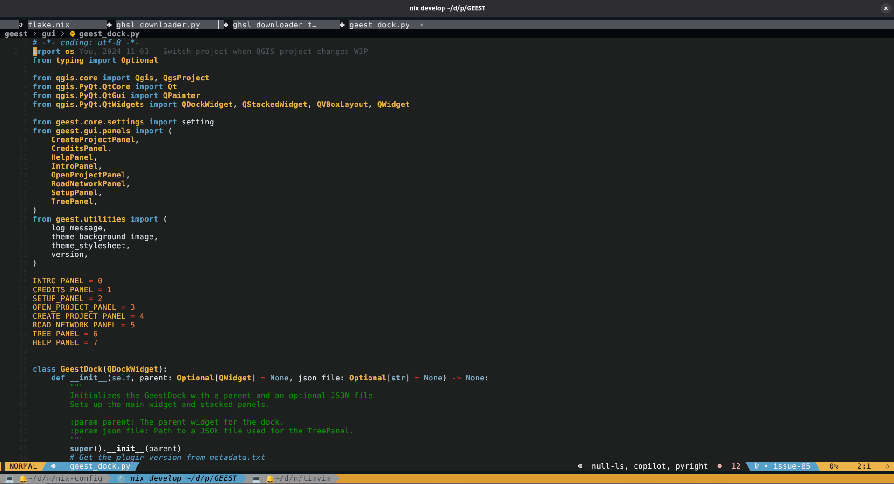

<h1 align="center">
  <a href="#"> [!WARNING 1] > **hardtime.nvim is available but disabled by default!**
>
> **Since I want to learn VIM Motions I have included hardtime-nvim with
> precognition, but it's disabled by default for a smoother initial experience.**
>
> - When enabled, holding or repeating `h/j/k/l` and other basic motions is discouraged.
> - You may see popups or be blocked for inefficient navigation when active.
> - This is intentional — to help you master efficient Vim motions.
>
> **Toggle it:** Press `<leader>th` to turn Hardtime ON or OFF at any time.
>
> **Tip:** Enable it when you want to practice efficient Vim motions!
>
> **Configure:** You can modify the plugin settings in `config/plugins/hardtime.nix`hubusercontent.com/catppuccin/catppuccin/main/assets/palette/macchiato.png" width="600px"/></a>
  <br><br>
  <div align="center">
    <p>
      <!-- ✅ Your existing badges -->
      <a href="https://github.com/timlinux/timvim/issues">
        
      </a>
      <a href="https://github.com/timlinux/timvim/pulse">
        
      </a>
      <a href="https://github.com/timlinux/timvim/stargazers">
        
      </a>
      <a href="https://github.com/timlinux/timvim">
        
      </a>
      <a href="https://github.com/timlinux/timvim/blob/main/LICENSE">
        
      </a>
    </p>
  </div>
</h1>
<h1 align = "center">TimVim: A Standalone NVF NeoVim Configuration forked from Schrovimger</h1>
<h3 align = "center"></h3>

</h1>

## Whats This All About ?

TimVim is a custom NeoVim configuration, based on the excellent
[Schrovimger](https://github.com/jack-thesparrow/schrovimger) project, to
smoothen out your development workflow providing an unparalled coding
experience.


<details>
    <summary>More!</summary>
    
    
</details>

<br>

>
> **Toggle Hard Time:** Press `<leader>th` to turn Hardtime ON or OFF at any time. It is off by default.
>
> **Tip:** Don’t be afraid to disable it when you want a break!
>

> [|WARNING 2]
>
> This setup autosaves any buffers when they lose focus or you quit!
> If you don't like this behaviour, see autosave.nix and session.nix.

## Features

- **Text-Editor/IDE**: TimVim aims to provide a non-bloated, minimal and
  distraction-free code writing experience.

- **Advanced Debugging**: Full Python remote debugging support with standard F-key shortcuts (F5, F8, F9, F10, F11, F12) and direct server connection for improved reliability.

- **Smart Code Completion**: nvim-cmp with ghost text support and intelligent Tab handling for LSP, buffer, and path completions.

- **NVF Integration:** Build upon the
  [NVF](https://github.com/NotAShelf/nvf.git) Framework which gives it a solid
  base for your personal configuration.

- **Customization:** The [NVF](https://github.com/NotAShelf/nvf.git) Framework
  provides customization options that are unrestricted, allowing it to be
  tailored according to your preferences.

- **Plugin Supports:** [NVF](https://github.com/NotAShelf/nvf.git) has various
  plugins also allowing to add your custom plugins.

## Installation

Getting TimVim installed and running on your system is a **easy AF**. Simply
follow the installation guide below and TimVim will get running in no time.

### InCase you'd like to test run

```shell
nix run github:timlinux/timvim
```

Or if you have a local checkout:

```shell
nix run .#
```

### Keybinds

The following is a comprehensive list of keybinds organised by topic in TimVim:

#### Navigation

| Key     | Mode | Description                          |
| ------- | ---- | ------------------------------------ |
| `H`     | n, v | Go to start of line                  |
| `L`     | n, v | Go to end of line                    |
| `K`     | n    | Hover Documentation                  |
| `<C-l>` | n    | Go to Definition                     |
| `<C-h>` | n    | Return from Definition               |
| `-`     | n    | Open Oil File Manager (Quick Access) |

#### AI Assistant (`<leader>a`)

| Key          | Mode | Description                        |
| ------------ | ---- | ---------------------------------- |
| `<leader>ac` | n    | Claude Code Chat (terminal split)  |
| `<leader>am` | v    | Modify selection with Claude Code  |
| `<leader>af` | n    | Open current file with Claude Code |
| `<leader>at` | n    | Claude Code terminal               |

#### Buffers (`<leader>b`)

| Key          | Mode | Description       |
| ------------ | ---- | ----------------- |
| `<leader>bb` | n    | Find Buffers      |
| `<leader>bl` | n    | Next Buffer       |
| `<leader>bh` | n    | Previous Buffer   |
| `<leader>bx` | n    | Close Buffer      |
| `<leader>bp` | n    | Pick Buffer       |
| `<leader>bj` | n    | Swap Buffer Down  |
| `<leader>bk` | n    | Swap Buffer Up    |
| `<leader>bs` | n    | Swap Buffer Left  |
| `<leader>bd` | n    | Swap Buffer Right |

#### Code (`<leader>c`)

| Key          | Mode | Description                |
| ------------ | ---- | -------------------------- |
| `<leader>cp` | n    | Colour Picker              |
| `<leader>cr` | n    | Rename Symbol              |
| `<leader>cf` | n    | Format Buffer              |
| `<leader>cc` | n    | Check Available Formatters |
| `<leader>cs` | n    | Show Minimap               |
| `<leader>ch` | n    | Hide Minimap               |
| `<leader>cm` | n    | Toggle Minimap             |
| `<leader>ci` | n    | Focus Minimap              |
| `<leader>co` | n    | Toggle Code Outline        |
| `<leader>pm` | n    | Preview Markdown (Direct)  |
| `<leader>cd` | n    | Go to Definition           |
| `<leader>cD` | n    | Go to Declaration          |
| `<leader>cI` | n    | Find Implementations       |
| `<leader>ct` | n    | Find Type Definitions      |
| `<leader>cR` | n    | Find References            |
| `<leader>cn` | n    | Next Diagnostic            |
| `<leader>cP` | n    | Previous Diagnostic        |

#### Debug (`<leader>d`)

| Key          | Mode | Description                         |
| ------------ | ---- | ----------------------------------- |
| `<leader>da` | n    | Attach to Remote Python (Port 9000) |
| `<leader>dl` | n    | Start/Continue Local Debugging      |
| `<leader>ds` | n    | Show Debug Status                   |
| `<leader>di` | n    | Check Debugpy Installation          |
| `<leader>dc` | n    | Continue                            |
| `<leader>db` | n    | Toggle Breakpoint                   |
| `<leader>du` | n    | Toggle DAP UI                       |
| `<leader>dr` | n    | Toggle REPL                         |
| `<leader>dh` | n    | Hover                               |
| `<leader>dq` | n    | Terminate                           |
| `<leader>dR` | n    | Restart                             |
| `<leader>d.` | n    | Run Last                            |
| `<leader>dn` | n    | Step Into                           |
| `<leader>dv` | n    | Step Over                           |
| `<leader>dt` | n    | Run to Cursor                       |
| `<leader>dj` | n    | Go Down Stack                       |
| `<leader>dk` | n    | Go Up Stack                         |

#### Files (`<leader>f`)

| Key          | Mode | Description                    |
| ------------ | ---- | ------------------------------ |
| `<leader>ff` | n    | Find Files with Names          |
| `<leader>fg` | n    | Find Files with Contents (FZF) |

| `<leader>fm` | n | Find Media Files |
| `<leader>fp` | n | Find Python Files |
| `<leader>fn` | n | Find Nix Files |
| `<leader>fs` | n | Find Symbols in Current File |
| `<leader>fo` | n | Open Oil File Manager |
| `<leader>fO` | n | Open Oil File Manager (Floating) |

#### Git (`<leader>g`)

| Key          | Mode | Description                     |
| ------------ | ---- | ------------------------------- |
| `<leader>gg` | n    | Open Git Terminal               |
| `<leader>gb` | n    | Git Blame Line                  |
| `<leader>gx` | n    | Toggle Git Blame                |
| `<leader>gl` | n    | Git Log (Telescope Git Commits) |
| `<leader>go` | n    | Toggle Git Outline              |
| `<leader>gs` | n, v | Stage Hunk                      |
| `<leader>gr` | n, v | Reset Hunk                      |
| `<leader>gS` | n    | Stage Buffer                    |
| `<leader>gR` | n    | Reset Buffer                    |
| `<leader>gu` | n    | Undo Stage Hunk                 |
| `<leader>gp` | n    | Preview Hunk                    |
| `<leader>gd` | n    | Diff This                       |
| `<leader>gD` | n    | Diff Project                    |
| `<leader>gn` | n    | Git Choose None                 |
| `<leader>gt` | n    | Git Choose Theirs               |
| `<leader>gc` | n    | Git Choose Ours                 |
| `<leader>ga` | n    | Git Choose Both                 |

#### Session (`<leader>s`)

| Key          | Mode | Description          |
| ------------ | ---- | -------------------- |
| `<leader>sm` | n    | Open Session Manager |
| `<leader>ss` | n    | Save Current Session |
| `<leader>sl` | n    | Load Last Session    |
| `<leader>so` | n    | Load Session         |
| `<leader>sd` | n    | Delete Session       |

#### Spell Checking (`<leader>z`)

| Key          | Mode | Description                           |
| ------------ | ---- | ------------------------------------- |
| `<leader>zs` | n    | Toggle Spell Check                    |
| `<leader>z=` | n    | Show Spell Suggestions                |
| `<leader>za` | n    | Add Word to Dictionary                |
| `<leader>zb` | n    | Mark Word as Bad                      |
| `<leader>zr` | n    | Remove Word from Dictionary           |
| `<leader>zf` | n    | Quick Fix with First Suggestion       |
| `<leader>zt` | n    | Toggle Syntax-based Spell Check      |
| `]s`         | n    | Next Misspelled Word                  |
| `[s`         | n    | Previous Misspelled Word              |

**Spell Checking Features:**

- Automatically enabled for Markdown files
- Available for Python files (strings, comments, docstrings only with `<leader>zt`)
- Integrated with autocomplete for spell suggestions
- Personal dictionary support
- Works with built-in Neovim spell checking

#### Toggles (`<leader>t`)

| Key          | Mode | Description                      |
| ------------ | ---- | -------------------------------- |
| `<leader>tt` | n, t | Toggle Floaterm                  |
| `<leader>tn` | n    | Toggle Neotree Filesystem        |
| `<leader>tf` | n    | Toggle Oil File Manager          |
| `<leader>th` | n    | Toggle HardTime                  |
| `<leader>tc` | n    | Toggle Treesitter Context        |
| `<leader>ti` | n    | Toggle Indent Guides             |
| `<leader>to` | n    | Toggle Code Outline Panel        |
| `<leader>tw` | n    | Toggle CursorHold Error Tooltips |
| `<leader>tp` | n    | Toggle Precognition              |
| `<leader>tm` | n    | Toggle Markdown Preview          |

#### Window Management (Smart Splits)

| Key     | Mode | Description             |
| ------- | ---- | ----------------------- |
| `<C-h>` | n    | Move cursor left        |
| `<C-j>` | n    | Move cursor down        |
| `<C-k>` | n    | Move cursor up          |
| `<C-l>` | n    | Move cursor right       |
| `<C-\>` | n    | Move cursor to previous |
| `<A-h>` | n    | Resize window left      |
| `<A-j>` | n    | Resize window down      |
| `<A-k>` | n    | Resize window up        |
| `<A-l>` | n    | Resize window right     |

#### Debug (DAP)

##### F-Key Shortcuts (Standard IDE Style)

| Key        | Mode | Description                     |
| ---------- | ---- | ------------------------------- |
| `F5`       | n    | **Continue** debugging          |
| `F8`       | n    | **Toggle Breakpoint**           |
| `F9`       | n    | **Step Over** (next line)       |
| `F10`      | n    | **Step Into** (enter functions) |
| `F11`      | n    | **Step Out** (exit function)    |
| `F12`      | n    | **Run to Cursor**               |
| `Shift+F5` | n    | **Terminate** debug session     |
| `Shift+F8` | n    | **Clear All Breakpoints**       |
| `Shift+F9` | n    | **Toggle Debug UI**             |

##### Leader Key Shortcuts (Alternative)

| Key          | Mode | Description                             |
| ------------ | ---- | --------------------------------------- |
| `<leader>dc` | n    | Continue debugging                      |
| `<leader>db` | n    | Toggle breakpoint                       |
| `<leader>dR` | n    | Restart debugger                        |
| `<leader>d.` | n    | Run last                                |
| `<leader>dt` | n    | Run to cursor                           |
| `<leader>dn` | n    | Step into                               |
| `<leader>dv` | n    | Step over                               |
| `<leader>dh` | n    | Debug hover                             |
| `<leader>dq` | n    | Terminate debugging                     |
| `<leader>du` | n    | Toggle DAP UI                           |
| `<leader>dr` | n    | Toggle REPL                             |
| `<leader>dj` | n    | Go down in stack                        |
| `<leader>dk` | n    | Go up in stack                          |
| `<leader>da` | n    | **Attach to remote Python** (port 9000) |
| `<leader>ds` | n    | Show debug status                       |
| `<leader>di` | n    | Check debugpy installation              |


#### Motion & Text Objects (Flash)

| Key     | Mode | Description       |
| ------- | ---- | ----------------- |
| `s`     | n, v | Jump to location  |
| `S`     | n, v | Treesitter jump   |
| `r`     | n, v | Remote jump       |
| `R`     | n, v | Treesitter search |
| `<C-s>` | n, v | Toggle search     |

#### Surround Operations

| Key      | Mode | Description                  |
| -------- | ---- | ---------------------------- |
| `gz`     | n    | Normal surround              |
| `gZ`     | n    | Normal current surround      |
| `gzz`    | n    | Normal line surround         |
| `gZZ`    | n    | Normal current line surround |
| `gzr`    | n    | Change surround              |
| `gZR`    | n    | Change line surround         |
| `gzd`    | n    | Delete surround              |
| `gz`     | v    | Visual surround              |
| `gZ`     | v    | Visual line surround         |
| `<C-g>z` | i    | Insert surround              |
| `<C-g>Z` | i    | Insert line surround         |

#### Code Completion (nvim-cmp)

| Key         | Mode | Description                           |
| ----------- | ---- | ------------------------------------- |
| `<CR>`      | i    | **Confirm/Accept selected completion** |
| `<Tab>`     | i    | **Smart Tab** (Complete → Next item)   |
| `<S-Tab>`   | i    | **Previous** completion item            |
| `<C-Space>` | i    | **Trigger completion menu**             |
| `<C-e>`     | i    | **Abort** completion menu               |

> **Note**: Includes ghost text support and LSP, buffer, and path completions.

#### Other Keybinds

| Key  | Mode | Description         |
| ---- | ---- | ------------------- |
| `gz` | n    | Surround operations |
| `F5` | n    | Toggle UndoTree     |

> **Note**: `<leader>` is typically mapped to the space key. Some keybindings
> may have conflicts or variations depending on the active mode and context.

## Python Remote Debugging Workflow

TimVim includes comprehensive Python debugging support via DAP (Debug Adapter Protocol) using `debugpy`. Here's how to set up and use remote Python debugging:

### Setup Remote Python Debugging

1. **In your Python code** (the remote process you want to debug):

   ```python
   import debugpy

   # Listen on port 9000 for debugger attachment
   debugpy.listen(9000)
   print("⏳ Waiting for debugger to attach...")
   debugpy.wait_for_client()  # Optional: blocks until debugger connects

   # Your code here - execution will pause here once debugger attaches
   your_function_to_debug()
   ```

2. **In Neovim**:
   - Open the Python file you want to debug
   - Set breakpoints using `<leader>db` where you want execution to pause
   - Attach to the remote process using `<leader>da` (Quick attach to port 9000)
   - Alternatively, use `<leader>dc` (Continue) and select "Remote Attach (9000)" from the picker

### Debug Session Workflow

1. **Start your Python process** with debugpy listening
2. **In Neovim**:
   - Press `<leader>da` to attach to the remote debugger
   - Or press `F5` and select "Direct Server Attach (9000)"
3. **Use debug controls** (F-keys recommended for speed):
   - **`F5`** - Continue execution
   - **`F9`** - Step over lines (most common)
   - **`F10`** - Step into functions
   - **`F11`** - Step out of functions
   - **`F8`** - Toggle breakpoints
   - **`F12`** - Run to cursor
   - **`Shift+F9`** - Toggle DAP UI for variables/call stack
   - `<leader>dr` - Toggle REPL for interactive debugging
   - **`Shift+F5`** - Terminate debugging session

### Key Features

- **F-Key Support**: Standard IDE-style F-key shortcuts (F5=Continue, F8=Breakpoint, F9=Step Over, etc.)
- **Direct Server Connection**: Improved adapter that connects directly to debugpy server for better reliability
- **Port Configuration**: Default remote debugging port is **9000**
- **Automatic UI**: DAP UI opens automatically showing variables, call stack, and breakpoints
- **Path Mapping**: Configured for local/remote path synchronization
- **Language Support**: Full Python debugging with `debugpy` and `pyright` LSP integration
- **Connection Testing**: Built-in connection verification before attempting to attach
- **Multiple Configurations**: Both direct server and standard executable adapter modes available

## Claude Code Integration

TimVim includes comprehensive Claude Code integration for AI-assisted coding:

### Claude Code Features

- **Chat Interface**: Direct terminal integration with Claude Code
- **Selection Modification**: Send selected text to Claude for modification
- **File Analysis**: Open current file with Claude Code for analysis
- **Ghost Text Completion**: nvim-cmp with LSP, buffer, and path sources

### Claude Code Usage

- `<leader>ac` - Open Claude Code chat in a terminal split
- `<leader>am` - Send selected text to Claude for modification (visual mode)
- `<leader>af` - Open current file with Claude Code
- `<leader>at` - Open Claude Code terminal

### AI-Assisted Development

Claude Code provides context-aware assistance for:
- Code explanation and documentation
- Refactoring and optimization
- Bug fixing and debugging
- Architecture guidance
- Best practices recommendations

### How to install TimVim in your system

To include the configuration as a replacement of Vanilla Neovim, you must first
add it as input in your main `flake.nix` of your NixOS system:

```nix
inputs.nvf = {
    url = "github:timlinux/timvim";
    inputs.nixpkgs.follows = "nixpkgs";
}
```

Then expose the input into your outputs as:

```nix
outputs = {
    ...
    nvf,
    ...
}@inputs:
```

Configuration:

```nix
# Modern nvf configuration with comprehensive features enabled
{
  pkgs,
  inputs,
  ...
}:
{
  environment.systemPackages = with pkgs; [
    inputs.nvf.packages.${pkgs.system}.default
  ];
}
```

**And now you have successfully installed TimVim NVF NeoVim Configuration!**

## Using in python projects

If you are using timvim for developing python projects you should add pyright
and python3 as packages to your project's flake for example in the dev shell.
Here is an exhuastive example:

```nix
devShells.default = pkgs.mkShell {
  packages =
    with pkgs;
    [
      chafa
      epub-thumbnailer
      fd
      ffmpegthumbnailer
      git
      imagemagick
      pre-commit
      poppler-utils
      nixfmt-rfc-style
      nixd
      nerd-fonts.jetbrains-mono
      ripgrep
      deadnix
      statix
      # No additional dependencies needed for Claude Code integration
      # Python development essentials
      python3
      pyright
      python3Packages.debugpy
      python3Packages.black
    ]
    ++ pkgs.lib.optionals pkgs.stdenv.isLinux [ pkgs.fontpreview ];
};
```

## Quick Start Guide

- `config/core` - contains all the core Vim Settings.

- `config/plugins` - contains NeoVim Plugins via NVF.

- `config/themes` - contains Theme options.

- `config/ui` - contains UI and Visual Options.

## Contribution

Contributions are welome! Feel Free to
[open an issue](https://github.com/timlinux/timvim/issues) to report problems,
suggest improvements, or submit pull requests to add new features to TimVim.

## Support

Encountered an issue or have a question? Visit the
[Issue Tracker](https://github.com/timlinux/timvim/issues)

## License

This project is licensed under the
[MIT License](https://github.com/timlinux/timvim/blob/main/LICENSE). See the
[LICENSE](https://github.com/timlinux/timvim/blob/main/LICENSE) file for more
details.

## Acknowledgements

- [GitHub - NotAShelf/nvf](https://github.com/NotAShelf/nvf.git) - For the
  excellent framework.

- [Schrovimger · GitHub](https://github.com/jack-thesparrow/timvim) - For the
  base project which provides 99% of the source in this repo.

- [Sly-Harvey · GitHub](https://github.com/Sly-Harvey) - For your clean and
  readable nixvim config which i used for reference.

- [GitHub - elythh/nixvim: ❄️ my neovim config using nixvim](https://github.com/elythh/nixvim) -
  For features to include.

- [zethra](https://git.sr.ht/~zethra/) - For your term2alpha tool, with which i
  configured my alpha-dashboard.
