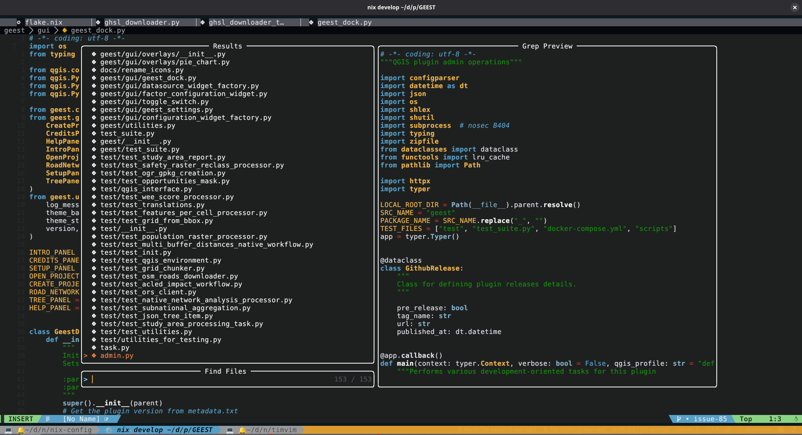

<h1 align="center">
  <a href="#"></a>
  <br><br>
  <div align="center">
    <p>
      <!-- ✅ Your existing badges -->
      <a href="https://github.com/timlinux/timvim/issues">
        
      </a>
      <a href="https://github.com/timlinux/timvim/pulse">
        
      </a>
      <a href="https://github.com/timlinux/timvim/stargazers">
        
      </a>
      <a href="https://github.com/timlinux/timvim">
        
      </a>
      <a href="https://github.com/timlinux/timvim/blob/main/LICENSE">
        
      </a>
    </p>
  </div>
</h1>
<h1 align = "center">TimVim: A Standalone NVF NeoVim Configuration forked from Schrovimger</h1>
<h3 align = "center"></h3>

</h1>

## Whats This All About ?

TimVim is a custom NeoVim configuration, based on the excellent
[Schrovimger](https://github.com/jack-thesparrow/schrovimger) project, to
smoothen out your development workflow providing an unparalled coding
experience.


<details>
    <summary>More!</summary>
    
    
</details>

<br>

> [!WARNING]
> **hardtime.nvim is configured with maximum strictness!**
>
> **Since I want to learn VIM Motions I have enabled hardtime-nvim with
> precognition!**
>
> - Holding or repeating `h/j/k/l` and other basic motions is discouraged.
> - You may see popups or be blocked for inefficient navigation.
> - This is intentional — to help you master efficient Vim motions.
>
> **Toggle it:** Press `<leader>ht` to turn Hardtime ON or OFF at any time.
>
> **Tip:** Don’t be afraid to disable it when you want a break!
>
> **Turn OFF:** You can turn the plugin off in `config/plugins/hardtime.nix`

## Features

- **Text-Editor/IDE**: TimVim aims to provide a non-bloated, minimal and
  distraction-free code writing experience.

- **NVF Integration:** Build upon the
  [NVF](https://github.com/NotAShelf/nvf.git) Framework which gives it a solid
  base for your personal configuration.

- **Customization:** The [NVF](https://github.com/NotAShelf/nvf.git) Framework
  provides customization options that are unrestricted, allowing it to be
  tailored according to your preferences.

- **Plugin Supports:** [NVF](https://github.com/NotAShelf/nvf.git) has various
  plugins also allowing to add your custom plugins.

## Installation

Getting TimVim installed and running on your system is a **easy AF**. Simply
follow the installation guide below and TimVim will get running in no time.

### InCase you'd like to test run:

```shell
nix run github:timlinux/timvim
```

Or if you have a local checkout:

```
nix run .#
```

````
### How to install TimVim in your system

To include the configuration as a replacement of Vanilla Neovim, you must first
add it as input in your main `flake.nix` of your NixOS system:

```nix
inputs.nvf = {
    url = "github:timlinux/timvim";
    inputs.nixpkgs.follows = "nixpkgs";
}
````

Then expose the input into your outputs as:

```nix
outputs = {
    ...
    nvf,
    ...
}@inputs:
```

Configuration:

```nix
# Modern nvf configuration with comprehensive features enabled
{
  pkgs,
  inputs,
  ...
}:
{
  environment.systemPackages = with pkgs; [
    inputs.nvf.packages.${pkgs.system}.default
  ];
}
```

<I>And now you have successfully installed TimVim NVF NeoVim Configuration!</I>

## Using in python projects

If you are using timvim for developing python projects you should add pyright
and python3 as packages to your project's flake for example in the dev shell.
Here is an exhuastive example:

```
:
```

## Quick Start Guide

- `config/core` - contains all the core Vim Settings.

- `config/plugins` - contains NeoVim Plugins via NVF.

- `config/themes` - contains Theme options.

- `config/ui` - contains UI and Visual Options.

## Contribution

Contributions are welome! Feel Free to
[open an issue](https://github.com/timlinux/timvim/issues) to report problems,
suggest improvements, or submit pull requests to add new features to TimVim.

## Support

Encountered an issue or have a question? Visit the
[Issue Tracker](https://github.com/timlinux/timvim/issues)

## License

This project is licensed under the
[MIT License](https://github.com/timlinux/timvim/blob/main/LICENSE). See the
[LICENSE](https://github.com/timlinux/timvim/blob/main/LICENSE) file for more
details.

## Acknowledgements

- [GitHub - NotAShelf/nvf](https://github.com/NotAShelf/nvf.git) - For the
  excellent framework.

- [Schrovimger · GitHub](https://github.com/jack-thesparrow/timvim) - For the
  base project which provides 99% of the source in this repo.

- [Sly-Harvey · GitHub](https://github.com/Sly-Harvey) - For your clean and
  readable nixvim config which i used for reference.

- [GitHub - elythh/nixvim: ❄️ my neovim config using nixvim](https://github.com/elythh/nixvim) -
  For features to include.

- [zethra](https://git.sr.ht/~zethra/) - For your term2alpha tool, with which i
  configured my alpha-dashboard.
